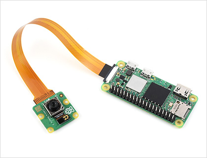

# RayBand Smart Glasses - Hardware Overview

## Introduction

RayBand is a voice-controlled smart glasses system built on the Raspberry Pi Zero 2 W platform. It features real-time speech recognition, face detection, and hands-free photo/video capture.

## System Specifications

### Computing Platform
- **Processor:** Raspberry Pi Zero 2 W (Quad-core ARM Cortex-A53 @ 1GHz)
- **RAM:** 512MB
- **Storage:** 32GB microSD card

### Camera System
- **Module:** Raspberry Pi Camera Module 3
- **Sensor:** Sony IMX708 (12MP)
- **Features:** Autofocus, 1080p video @ 30fps
- **Field of View:** 75° (standard) or 120° (wide variant)

### Audio System
- **Microphone:** INMP441 I2S MEMS Digital Microphone
- **Interface:** I2S digital audio
- **Connectivity:** GPIO pins

### Power System
- **Battery:** 3.7V 500mAh LiPo (standard) or 1000mAh (extended)
- **Runtime:** ~1-2 hours (standard), ~2-4 hours (extended)
- **Charging:** USB-C via MP2636 module
- **Output:** 5V boost converter for Raspberry Pi

### Physical Dimensions
- **Weight:** ~50g (without glasses frame)
- **Mount:** Sugru moldable adhesive or 3D printed brackets

## Features

✅ **Voice Control**
- "Take a picture" - Captures photo
- "Start recording" - Begins video recording
- "Stop recording" - Ends video recording

✅ **Computer Vision**
- Real-time face detection
- Optional face recognition
- Live video overlay with transcript

✅ **Connectivity**
- WiFi 802.11n (built-in)
- Bluetooth 4.2 (built-in)
- USB OTG for accessories

## Total Cost

**Base System:** $105 USD
**With Upgrades:** $123-173 USD

See [Bill of Materials (BOM)](bom.md) for detailed parts list.

## Assembly Guide

Follow these guides in order:

1. [Bill of Materials](bom.md) - Acquire all components
2. [Assembly Instructions](assembly.md) - Physical assembly
3. [Raspberry Pi Setup](raspberry-pi-setup.md) - Software installation
4. [../software/installation.md](../software/installation.md) - RayBand software

## Safety Warnings

⚠️ **Lithium Battery Safety**
- Never puncture or crush LiPo batteries
- Use appropriate charging current (1C max)
- Store batteries at 3.7-3.8V when not in use
- Dispose of damaged batteries properly

⚠️ **Camera Privacy**
- Always inform people when recording
- Follow local laws regarding recording in public
- Add visible indicator LED when recording

⚠️ **Walking Safety**
- Do not use while driving
- Be aware of surroundings when using
- Display partially obstructs vision

## Support & Community

- **GitHub Issues:** [Report bugs](https://github.com/SoloScriptSage/rayband-voice-cam/issues)
- **Documentation:** See `docs/` folder
- **License:** GPL-3.0

## Next Steps

➡️ Start with the [Assembly Guide](assembly.md)